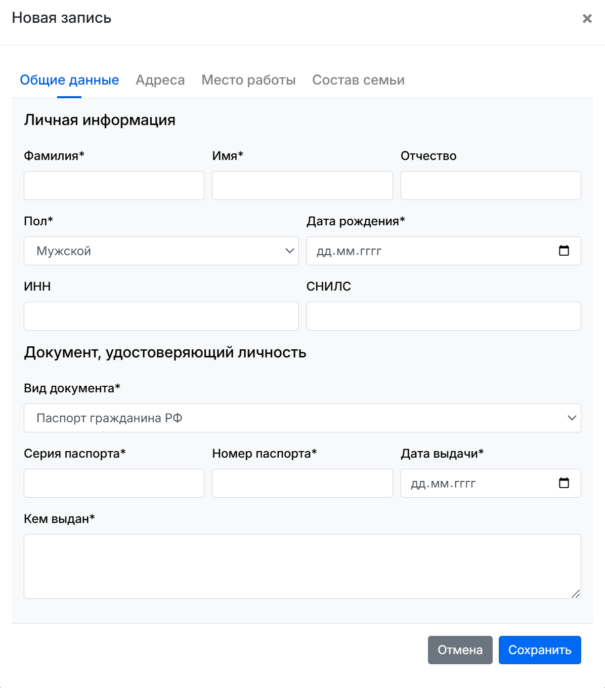
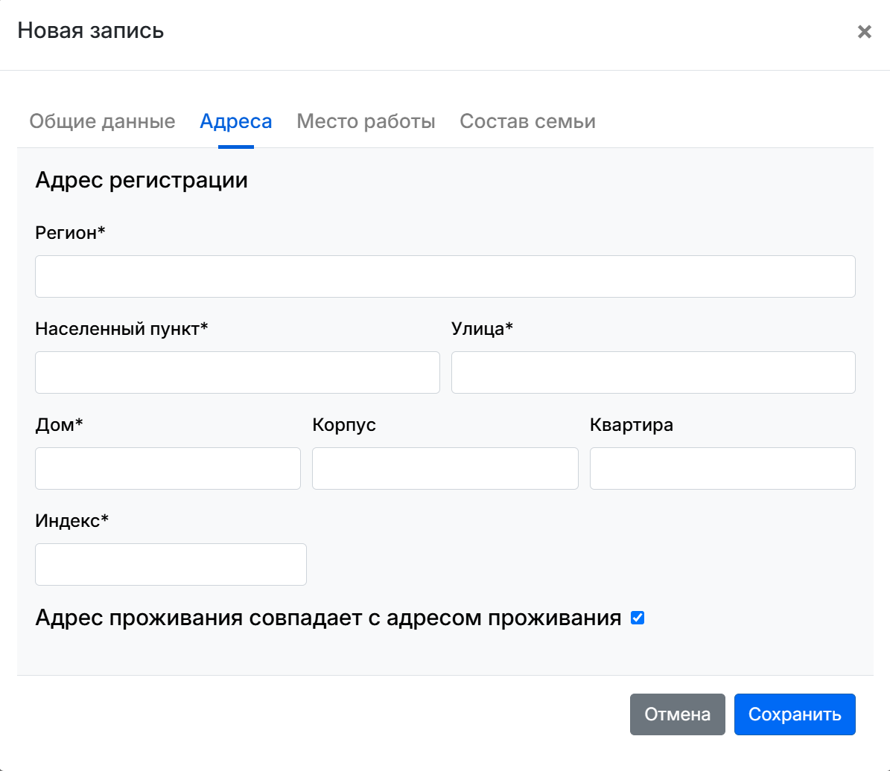
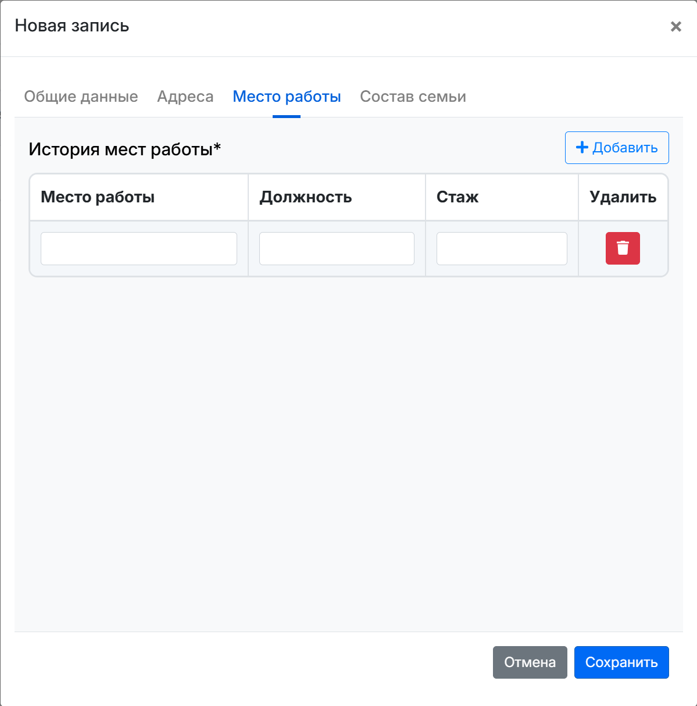
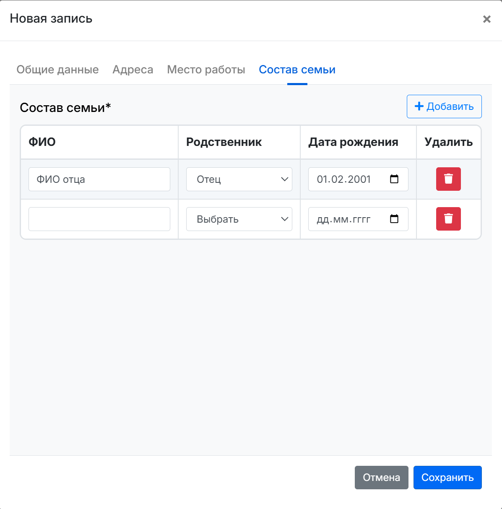

# Разработка интерфейса

## Описание задачи
В рамках данного задания требуется разработать пользовательский интерфейс, ориентированный на конкретные нужды заказчика. Необходимо выбрать один из предложенных вариантов (или предложить собственный), а затем представить прототип или готовый дизайн.

## Проверяемые навыки
- Навык разработки интерфейсов
- Понимание нужд заказчика
- Логическое мышление
- Предметное мышление

---

## Материалы и ресурсы
В ходе выполнения задания были подготовлены четыре скриншота (примеры интерфейса):

1. **photo-1.png**  
     
   *Окно с общими данными*  

2. **photo-2.png**  
   
   
   *Окно с адресами. В случае невыбранного чекбокса отображаются такие же поля как выше *  

3. **photo-3.png**  
     
   *Окно с историей мест работы*  

4. **photo-4.png**  
   

   *Окно с составом семьи*  

---

